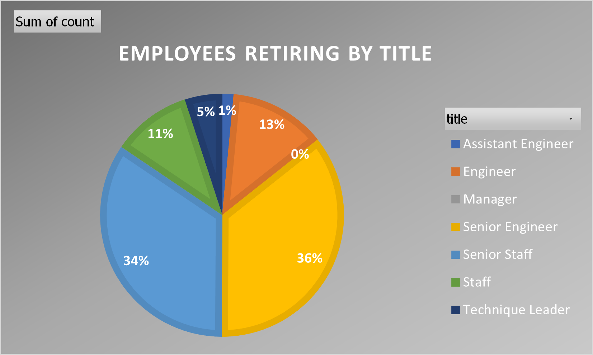
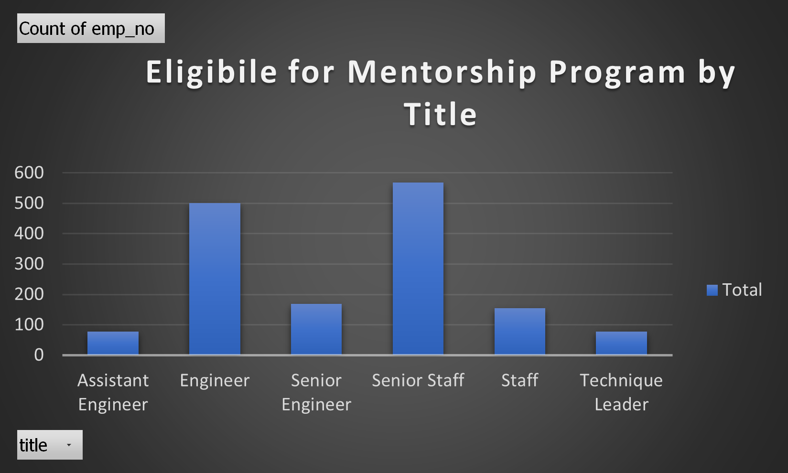

# Pewlett-Hackard-Analysis

### Project Overview

Pewlett Hackard, a large company with several thousand employees has noticed that baby boomers are beginning to retire at a rapid rate. With this in mind they are looking to find out which positions will need to be filled in the near future and offering retirement packets to those employees that meet certain criteria.

Questions that are being asked are:
- Who will be retiring in the next few years?
- How many positions will Pewlett Hackard need to fill?

### Resources
- Date Sources: departments.csv, dept_emp.csv, dept_manager.csv, employees.csv, salaries.csv, titles.csv
- Software: PostgreSQL 14.6, pgAdmin4 6.18, Atom 1.63.1

### Results
- Senior Engineers and Senior Staff will suffer the greatest loses with this retirement wave, losing 25,916 and 24,926 employees respectively.
- By comparison Senior Engineers and Senior Staff also have the greatest amount of mentorship program eligible employees to help train and develop younger employees.
- Two managers will be retiring in this "Silver Wave," and there are no employees currently eligible to be a mentor for this role.
- The should be a significant focus on developing senior leadership, so that someone that will be around for more than just a few years steps in to fill the management roles that will be left vacant. If the company looks more long term in this aspect they will not be forced to fill the role again in a very short period of time.

Pewlett Hackard is looking to start a mentorship program where employees that are eligible to be a part of the program were born in 1965 and are currently employed. These employees still have approximately 10 years  before retirement ensuring they will have plenty of time to mentor the new, younger employees so institutional knowledge is not completely lost.

### Summary
Pewlett Hackard should expect 144,916 employees to retire within the next four years, with 16,981 of those roles that will need to be filled immediately. Year four and the final wave of retirements will result in 18,537 employees retiring.

It does not appear that there are enough retirement-ready employees to mentor the next generation of employees as there are only 1,549 total employees eligible. For example, retiring in this silver tsunami there are 25,916 Senior Engineers retiring but only 169 Senior Engineers are eligible for the mentorship program. However, the first year of the "silver tsunami" is only losing 6,138 Senior Engineers (those that were born in 1952), the remaining others that are ready to retire also help out to mentor some of the younger generation until retirement this would alleviate some of the burden.
